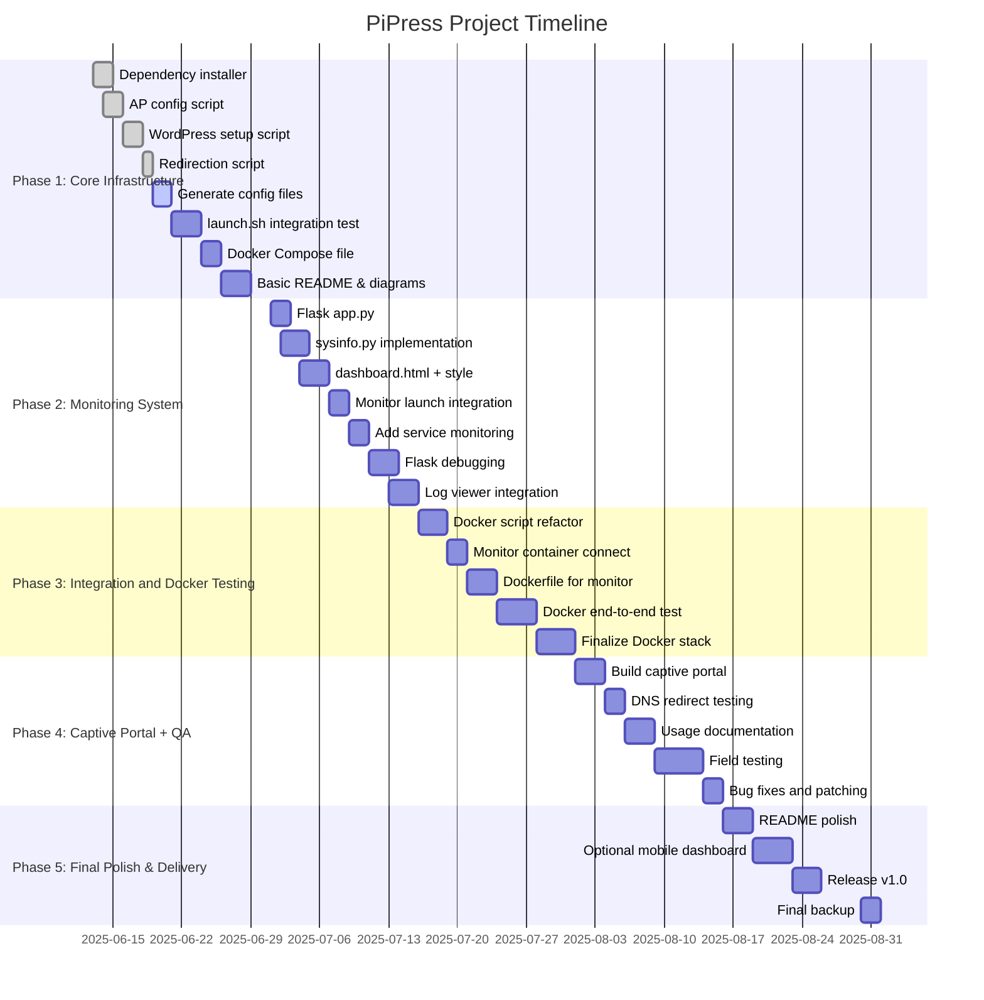

# PiPress Project Gantt Chart

**Project Goal:** Complete PiPress (WordPress AP Server + Monitoring) by August 31, 2025  
**Timeline:** June 13 – August 31, 2025

---

## Gantt Chart (Mermaid Format)

---

## Progress Table

| Phase                         | Task                        | Status   |
|------------------------------|-----------------------------|----------|
| Phase 1: Core Infrastructure | install_dependencies.sh      | ✅ Done  |
|                              | configure_ap.sh              | ✅ Done  |
|                              | setup_wordpress.sh           | ✅ Done  |
|                              | redirect_clients.sh          | ✅ Done  |
|                              | config files                 | 🟡 In Progress |
|                              | launch.sh integration        | ⬜ Pending |
|                              | docker-compose.yml           | ✅ Done  |
|                              | README & diagrams            | ⬜ Pending |
| Phase 2: Monitoring System   | app.py                       | ✅ Done  |
|                              | dashboard.html               | ✅ Done  |
|                              | sysinfo.py                   | ⬜ Pending |
|                              | launch integration           | ✅ Done  |
|                              | monitor service control      | ⬜ Pending |
|                              | Flask bug fixes              | ⬜ Pending |
|                              | error log viewer             | ⬜ Pending |
| Phase 3: Docker Integration  | Docker script refactor       | ⬜ Pending |
|                              | monitoring container         | ⬜ Pending |
|                              | Dockerfile for monitor       | ⬜ Pending |
|                              | E2E test & final validation  | ⬜ Pending |
| Phase 4: QA & Captive Portal | captive portal page          | ⬜ Pending |
|                              | DNS redirect testing         | ⬜ Pending |
|                              | user guide/docs              | ⬜ Pending |
|                              | real-world testing           | ⬜ Pending |
|                              | bug patch/fix                | ⬜ Pending |
| Phase 5: Final Delivery      | polish README/screenshots    | ⬜ Pending |
|                              | optional mobile UI           | ⬜ Pending |
|                              | tag & release v1.0           | ⬜ Pending |
|                              | backup/export                | ⬜ Pending |
