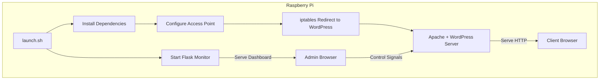

# PiPress: WordPress AP Server for Raspberry Pi

PiPress is a self-contained tool designed to launch a fully functional WordPress server on a headless Raspberry Pi. It sets up the Pi as a wireless access point (AP mode) and hosts a LAN-based WordPress site that automatically redirects any connected client to the homepage.

## Project Purpose

The goal of this project is to provide a plug-and-play Raspberry Pi WordPress server that:

- Works without a monitor (headless setup)
- Creates a local Wi-Fi hotspot using AP mode
- Hosts a WordPress site accessible by any connected client
- Automatically redirects connected clients to the WordPress homepage
- Checks for and installs required dependencies at launch
- Provides a monitoring and logging interface to remotely manage the WordPress instance

## Project Goals

1. Dependency Checker & Installer
   - Verify presence of required packages (Apache, PHP, MariaDB, Hostapd, Dnsmasq, etc.)
   - Automatically install missing dependencies

2. Wi-Fi Access Point Setup
   - Configure Raspberry Pi to act as a standalone Wi-Fi access point (AP mode)
   - Serve static IP (e.g. 192.168.4.1) to connected clients

3. WordPress Hosting
   - Automatically install and configure WordPress
   - Set up LAMP or Docker-based stack for easy deployment

4. Client Redirection
   - Automatically redirect any HTTP browser requests from connected clients to the WordPress site
   - Serve a captive portal or force redirect via DNS hijacking and iptables rules

5. Headless Operation
   - All operations are controlled via startup scripts
   - No need for external monitor, keyboard, or GUI

6. Monitoring Server
   - Lightweight Flask app served on a different port (default: 5000)
   - Displays system status including RAM, CPU, disk, and log output
   - Allows remote starting, stopping, or restarting the WordPress (Apache) service
   - View terminal error messages and health of the server in real time

## Deployment

PiPress can be deployed in two ways:

1. Manual Script-Based Deployment
   - Use the `launch.sh` script to install dependencies, configure the access point, and launch WordPress and the monitoring service.
   - This option gives full control over system-level setup and is useful for debugging or custom configurations.

2. Docker-Based Deployment
   - Use the included `docker-compose.yml` file to spin up WordPress, MariaDB, and the monitoring server in isolated containers.
   - Simplifies installation and keeps services contained.
   - Run with: `docker-compose up -d`

## Mermaid Architecture Diagram



## Planned Features

- [ ] launch.sh: One-click setup and launch script
- [ ] Modular components: separate scripts for dependency check, AP config, WordPress install, redirect setup
- [ ] Captive portal with customizable landing page
- [ ] Support for both LAMP and Docker WordPress deployments
- [ ] Flask-based monitoring dashboard
- [ ] Optional settings via config file

## Dependencies

- apache2, php, php-mysql, mariadb-server
- hostapd, dnsmasq, iptables
- curl, wget, dnsutils, net-tools
- python3, python3-flask, python3-psutil

## Folder Structure (Planned)

```
PiPress/
├── README.md
├── launch.sh
├── docker-compose.yml
├── tools/
│   ├── install_dependencies.sh
│   ├── configure_ap.sh
│   ├── setup_wordpress.sh
│   ├── redirect_clients.sh
│   └── utils.sh
├── config/
│   └── hostapd.conf
│   └── dnsmasq.conf
├── www/
│   └── captive-portal/index.html
└── monitor/
    ├── app.py
    ├── templates/
    │   └── dashboard.html
    ├── static/
    │   └── style.css
    └── utils/
        └── sysinfo.py
```

## License

MIT License — open to contributions and customization.
